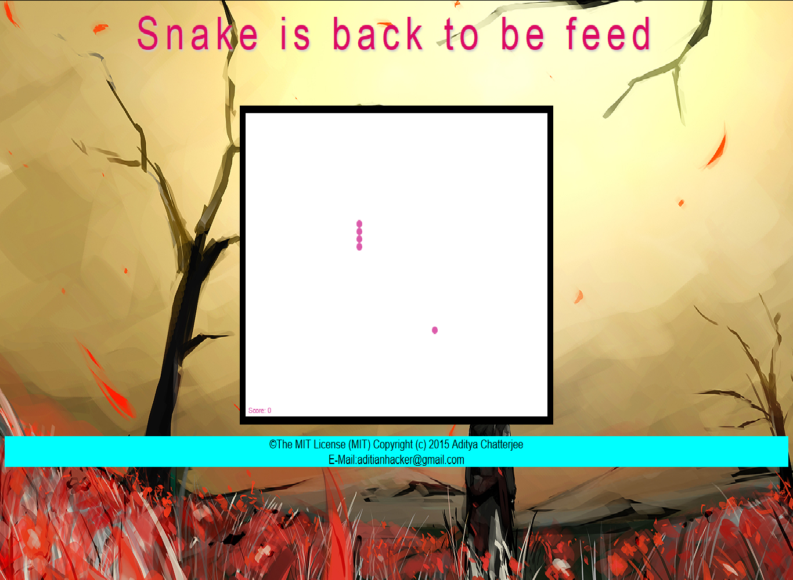

KingCobra is an open source client side single player game written in JavaScript along with HTML5 and CSS3. The game is in the beta development stage and looks forward for further improvements in functionality in order to stimulate the re-birth of the classical snake feeding game. The choice of the language makes it runnable on practically every computing device on Earth which comes along with a web browser. 

Author : Aditya Chatterjee 
E-mail ID : aditianhacker@gmail.com 

Video : https://www.youtube.com/watch?v=dWNgEYb1NRA

The current state of the gaming engine is visually as follows :  

Contributions : 
All considerations of developments would be looked upon and is expected to trigger the rebirth. Support my effort of bring the classical lost games back to life with a new vigour and more importantly accessible to all. 

License : MIT License Copyright (c) 2015 Aditya Chatterjee 
          Consider the LINCENSE.md file to keep up my effort. 
          
Soon web application will be launched.
